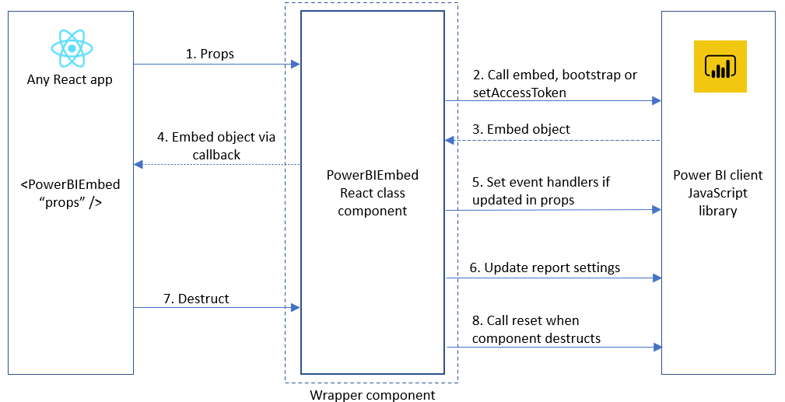

# powerbi-client-react
Power BI React component. This library lets you embed Power BI report, dashboard, dashboard tile, report visual, or Q&A in your React application.

## Quick Start

## Import

```jsx
import { PowerBIEmbed } from 'powerbi-client-react';
```

## Embed a Power BI report
```jsx
<PowerBIEmbed
	embedConfig = {{
		type: 'report',   // Supported types: report, dashboard, tile, visual and qna
		id: '<Report Id>',
		embedUrl: '<Embed Url>',
		accessToken: '<Access Token>',
		tokenType: models.TokenType.Embed,
		settings: {
			panes: {
				filters: {
					expanded: false,
					visible: false
				}
			},
			background: models.BackgroundType.Transparent,
		}
	}}

	eventHandlers = { 
		new Map([
			['loaded', function () {console.log('Report loaded');}],
			['rendered', function () {console.log('Report rendered');}],
			['error', function (event) {console.log(event.detail);}]
		])}
		
	cssClassName = { "report-style-class" }

	getEmbeddedComponent = { (embeddedReport) => {
		this.report = embeddedReport as Report;
	}}
/>
```

### How to [bootstrap a PowerBI report](https://aka.ms/PbieBootstrap):
```jsx
<PowerBIEmbed
	embedConfig = {{
		type: 'report',   // Supported types: report, dashboard, tile, visual and qna
		id: undefined, 
		embedUrl: undefined,
		accessToken: undefined,    // Keep as empty string, null or undefined
		tokenType: models.TokenType.Embed
	}}
/>
```
Note: To embed the report after bootstrap, update the props (with atleast accessToken).

## Demo

A React application that embeds a sample report using the _PowerBIEmbed_ component.<br/>
It demonstrates the complete flow from bootstrapping the report, to embedding and updating the embedded report.

Pre-requisite commands to be run only once:

```
npm install
npm run build
npm pack
```

To run the demo on localhost, run the following commands:

```
npm run install:demo
npm run demo
```

Redirect to http://localhost:8080/ to view in the browser.

Note: _powerbi-client-react_ is installed in demo app via .tgz file (output of `npm pack`). 
This is required (only in demo app) to work with the _powerbi-report-authoring_ package.
In your React App, just add  _[powerbi-report-authoring](https://www.npmjs.com/package/powerbi-report-authoring)_ as NPM dependencies.

## Flow Diagram for the Wrapper Component:


## Usage
|Use case|Details|
|:------|:------|
|Embed Power BI|To embed your powerbi artifact, pass the component with atleast _type_, _embedUrl_ and _accessToken_ in _embedConfig_ prop.|
|Get reference to the embedded object|Pass a callback method which accepts the embedded object as parameter to the _getEmbed_ of props.<br/>Refer to the _getEmbed_ prop in [Quick Start](#Quick-Start).|
|Apply style class|Pass the name(s) of classes to be set as "classname" for the embed container div via _className_ of props.|
|Set event handlers|Pass a map object of event name (string) and event handler (function) to the _eventHandlers_ of props. <br/>Key: Event name <br/>Value: Method to be triggered|
|Reset event handlers|To reset event handler for an event, set the event handler's value as `null` in the _eventHandlers_ map of props.|
|Set new accessToken|To set new accessToken in the same embedded powerbi artifact, pass the updated _accessToken_ in _embedConfig_ of props.<br/>Example scenario: _Current token has expired_.|
|Update settings (Report type only)|To update the report settings, update the _embedConfig.settings_ property of props.<br/>Refer to the _embedConfig.settings_ prop in [Quick Start](#Quick-Start).<br/>__Note__: Update the settings only by updating embedConfig prop|
|Bootstrap Power BI|To [bootstrap your powerbi entity](https://aka.ms/PbieBootstrap), pass the props to the component without _accessToken_ in _embedConfig_.<br/>__Note__: _embedConfig_ of props should atleast contain __type__ of the powerbi entity being embedded. <br/>Available types: "report", "dashboard", "tile", "visual" and "qna".<br/>Refer to _How to bootstrap a report_ section in [Quick Start](#Quick-Start).|
|Using with PowerBI Report Authoring|1. Install [powerbi-report-authoring](https://www.npmjs.com/package/powerbi-report-authoring) as npm dependency.<br>2. Use the report authoring APIs using the embedded report's instance|

Note: __Phased Loading__ is not supported with powerbi-client-react.

Note: To use this library in IE browser, use [react-app-polyfill](https://www.npmjs.com/package/react-app-polyfill) to add support for the incompatible features. Refer to the imports of [demo/index.tsx](demo\index.tsx).

### Props interface

```ts
interface EmbedProps {

	// Configuration for embedding the PowerBI entity (required)
	embedConfig: IEmbedConfiguration | IQnaEmbedConfiguration

	// Callback method to get the embedded PowerBI entity object (optional)
	getEmbed?: { (embeddedComponent: Embed): void }

	// Map of pair of event name and its handler method to be triggered on the event (optional)
	eventHandlers?: Map<string, service.IEventHandler<any> | null>

	// CSS class to be set on the embedding container (optional)
	cssClassName?: string

	// Provide a custom implementation of PowerBI service (optional)
	service?: service.Service
}
```

## Dependencies

[powerbi-client](https://www.npmjs.com/package/powerbi-client)

## Peer dependencies

[react](https://www.npmjs.com/package/react)

## Contributing

This project welcomes contributions and suggestions. Most contributions require you to agree to a Contributor License Agreement (CLA) declaring that you have the right to, and actually do, grant us the rights to use your contribution. For details, visit <https://cla.opensource.microsoft.com>.

When you submit a pull request, a CLA bot will automatically determine whether you need to provide a CLA and decorate the PR appropriately (e.g., status check, comment). Simply follow the instructions provided by the bot. You will only need to do this once across all repos using our CLA.

This project has adopted the [Microsoft Open Source Code of Conduct](https://opensource.microsoft.com/codeofconduct/). For more information see the [Code of Conduct FAQ](https://opensource.microsoft.com/codeofconduct/faq/) or contact [opencode@microsoft.com](mailto:opencode@microsoft.com) with any additional questions or comments